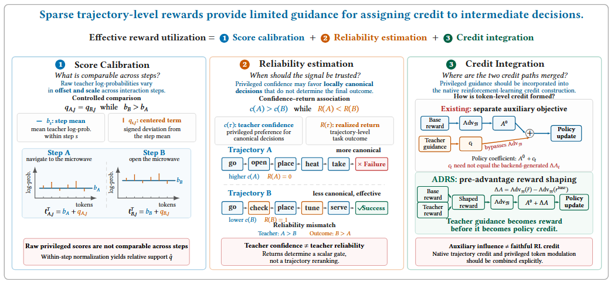
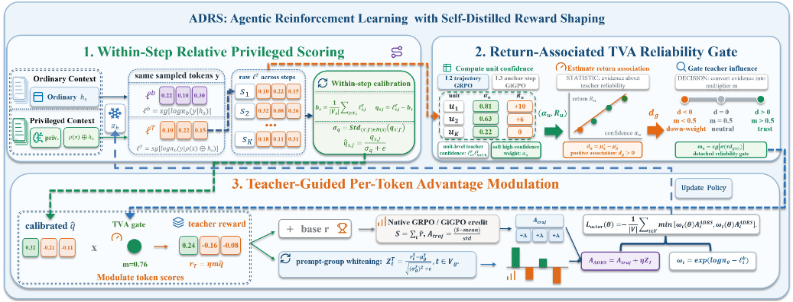
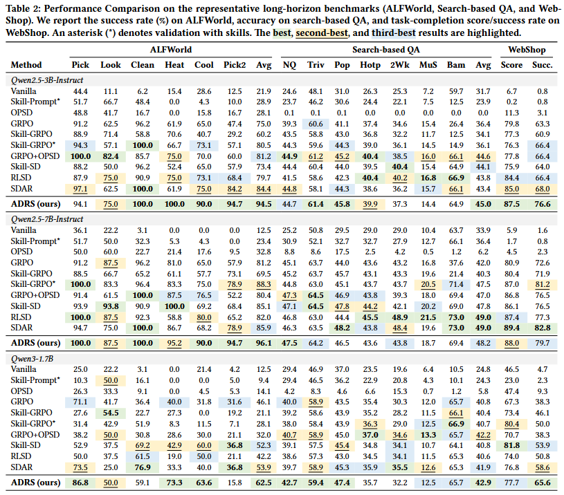

<h1 align="center">
ADRS: Agentic Reinforcement Learning with Self-Distilled Reward Shaping
</h1>

<p align="center">
  Ranxu Zhang &middot; Guinan Chen &middot; Chenshaodong &middot; Jinghao Lin<br>
  Xiaozhou Xu &middot; Sunzhe &middot; Yanyong Zhang &middot; Chao Wang
</p>

<p align="center">
  <a href="https://arxiv.org/abs/2608.03223"></a>
  <a href="LICENSE"></a>
</p>

We prove that all gated distillation losses (OPSD, SDAR, SkillSD) are mathematically equivalent to suboptimal token-level reward shaping. Based on this insight, we propose **ADRS** — a unified framework that injects teacher knowledge as TVA-modulated reward shaping instead of a separate distillation loss:

```
Traditional:  L = L_RL(r_env) + lambda * L_KD(gate * KL)     <-- two losses, gradient conflict
ADRS:         L = L_RL(r_env + eta * TVA * r_teacher)         <-- one loss, unified credit assignment
```

## Overview

### Motivation and Challenges

<p align="center">
  <a href="assets/adrs_challenges.png">
    
  </a>
</p>

<p align="center"><em>ADRS addresses within-step score calibration, return-associated reliability estimation, and the integration of teacher guidance into policy credit.</em></p>

### ADRS Framework

<p align="center">
  <a href="assets/adrs_framework.png">
    
  </a>
</p>

<p align="center"><em>The ADRS pipeline calibrates privileged scores, estimates their reliability with TVA, and injects the resulting teacher reward into the native policy objective.</em></p>

## Key Results

### Full Benchmark Comparison

<p align="center">
  <a href="assets/main_results.png">
    
  </a>
</p>

<p align="center"><em>Performance comparison on ALFWorld, Search-based QA, and WebShop. Click the table to view it at full resolution.</em></p>

Results across 3 benchmarks and 3 model sizes (150 training steps):

| Model | ALFWorld | WebShop | Search-QA |
|:------|:--------:|:-------:|:---------:|
| **Qwen2.5-3B** | **94.5%** | **76.6%** | **45.0%** |
| **Qwen2.5-7B** | **96.1%** | **79.7%** | **48.2%** |
| **Qwen3-1.7B** | **62.5%** | **65.6%** | **42.9%** |

Comparison with baselines (Qwen2.5-3B, ALFWorld, 150 steps):

| Method | Peak SR | Final SR | Steps to 70% | Extra Compute |
|:-------|:-------:|:--------:|:------------:|:-------------:|
| GRPO | 68.8% | 66.4% | -- | -- |
| GiGPO | 71.9% | 67.2% | -- | -- |
| SDAR | 78.1% | 78.1% | step 130 | distill fwd+bwd |
| **ADRS** | **94.5%** | **94.5%** | **step 70** | **<1%** |

## Method

### Equivalence Theorem: Distillation = Reward Shaping

For any gated distillation loss, its gradient is equivalent to policy gradient with shaped advantage:

```
grad(L_RL + lambda * L_KD) = -sum_t [A_t + lambda * w_t] * grad(log pi(y_t))
                                     └── shaped advantage ──┘
```

All existing methods are doing reward shaping without knowing it — and doing it suboptimally.

### LUPI Framework (Transferable vs Privileged Knowledge)

Skill distillation is a Learning Using Privileged Information (LUPI) problem:

```
KL(teacher || student) = K^T (transferable knowledge) + K^P (privilege artifact)

K^T: "open the fridge before taking items"   -- learnable from reward
K^P: "Let me analyze the task..."             -- caused by skill text format, not reproducible
```

SDAR distills K^T + K^P together, causing style overfitting. ADRS only shapes K^T.

### Three-Level TVA Hierarchy

| Level | Granularity | Requirement | Signal |
|:-----:|:-----------:|:-----------:|--------|
| L3 | Step-level | Anchor state grouping (GiGPO) | TVA = E[R\|aligned] - E[R\|divergent] |
| L2 | Completion-level | K>1 completions per prompt (GRPO) | Completion-level TVA |
| L1 | Token-level | Teacher + ref logprobs | PAS = log pi_T - log pi_ref |

Auto-selects the finest available level.

## Project Structure

```
ADRS/
├── verl/trainer/ppo/
│   ├── adrs_utils.py              # Core: teacher reward + 3-level TVA + modulation
│   ├── adrs_ray_trainer.py        # Trainer: inject teacher reward before advantage
│   ├── core_algos.py              # Base PPO/GRPO algorithms
│   └── sdar_utils.py              # SDAR baseline
├── verl/trainer/
│   ├── main_adrs.py               # ADRS entry point
│   ├── main_sdar.py               # SDAR entry point
│   └── main_trace.py              # TRACE entry point
├── gigpo/
│   └── core_gigpo.py              # GiGPO step-level advantage
├── agent_system/
│   ├── environments/              # ALFWorld, WebShop, Search-QA environments
│   ├── multi_turn_rollout/        # Multi-turn trajectory collection
│   └── reward_manager/            # Episode-level reward computation
├── skills/                        # Teacher skill descriptions (privileged knowledge)
│   ├── alfworld/                  # Household task skills
│   ├── webshop/                   # Shopping task skills
│   └── search/                    # Search-QA skills
├── examples/
│   ├── adrs_trainer/              # ADRS experiment scripts (3 envs x 3 models)
│   ├── grpo_trainer/              # GRPO baseline scripts
│   ├── sdar_trainer/              # SDAR baseline scripts
│   ├── gigpo_trainer/             # GiGPO baseline scripts
│   └── ...                        # Other baselines (RLSD, SkillSD, OPSD, etc.)
├── analysis/
│   ├── paper_figures/             # Publication figures (PDF)
│   └── paper_logs/                # Training logs backing paper tables (JSONL)
└── tests/
    └── test_adrs.py               # Unit tests for ADRS core
```

## Installation

```bash
conda create -n adrs python==3.12 -y
conda activate adrs

pip3 install vllm==0.11.0
pip3 install flash-attn==2.7.4.post1 --no-build-isolation --no-cache-dir
pip install -e .
```

### Environment Setup

#### ALFWorld
```bash
pip3 install gymnasium==0.29.1 stable-baselines3==2.6.0 alfworld
alfworld-download -f
export ALFWORLD_DATA=$HOME/data/alfworld
```

#### WebShop
See [WebShop](https://github.com/princeton-nlp/WebShop) for environment setup.

#### Search-QA
Requires a retrieval server with E5 index. See the search scripts in `examples/adrs_trainer/` for the full setup including index building and server startup.

## Training

### ADRS (proposed method)

```bash
# ALFWorld — Qwen2.5-3B (4 GPUs)
bash examples/adrs_trainer/run_alfworld_3b_grpo_star_fix5.sh

# WebShop — Qwen2.5-3B (2 GPUs)
bash examples/adrs_trainer/run_webshop_3b_grpo_star_fix5.sh

# Search-QA — Qwen2.5-7B (8 GPUs, includes retrieval server setup)
bash examples/adrs_trainer/run_search_7b_grpo_star_fix5.sh
```

All 9 experiment configurations (3 environments x 3 model sizes):

| | Qwen2.5-3B | Qwen2.5-7B | Qwen3-1.7B |
|---|---|---|---|
| ALFWorld | `run_alfworld_3b_grpo_star_fix5.sh` | `run_alfworld_7b_grpo_star_fix5.sh` | `run_alfworld_qwen3_grpo_star_fix5.sh` |
| WebShop | `run_webshop_3b_grpo_star_fix5.sh` | `run_webshop_7b_grpo_star_fix5.sh` | `run_webshop_qwen3_grpo_star_fix5.sh` |
| Search-QA | `run_search_3b_grpo_star_fix5.sh` | `run_search_7b_grpo_star_fix5.sh` | `run_search_qwen3_grpo_star_fix5.sh` |

### Baselines

```bash
# GRPO
bash examples/grpo_trainer/run_alfworld_3b.sh

# SDAR
bash examples/sdar_trainer/run_alfworld_3b.sh

# GiGPO
bash examples/gigpo_trainer/run_alfworld_3b_4gpu.sh
```

## Unit Tests

```bash
python -m pytest tests/test_adrs.py -v
```

## Citation

```bibtex
@misc{adrs2026,
  title={Agentic Reinforcement Learning with Self-Distilled Reward Shaping},
  author={Ranxu Zhang and Guinan Chen and Chenshaodong and Jinghao Lin and Xiaozhou Xu and Sunzhe and Yanyong Zhang and Chao Wang},
  year={2026},
  eprint={2608.03223},
  archivePrefix={arXiv},
  primaryClass={cs.LG},
  url={https://arxiv.org/abs/2608.03223},
}
```

## Acknowledgement

This project builds on [SDAR](https://arxiv.org/abs/2605.15155), [verl-agent](https://github.com/langfengQ/verl-agent) (GiGPO), [veRL](https://github.com/volcengine/verl), [ALFWorld](https://github.com/alfworld/alfworld), [WebShop](https://github.com/princeton-nlp/WebShop), and [Search-R1](https://github.com/PeterGriffinJin/Search-R1).

## License

This project is licensed under the Apache License 2.0 — see the [LICENSE](LICENSE) file for details.
